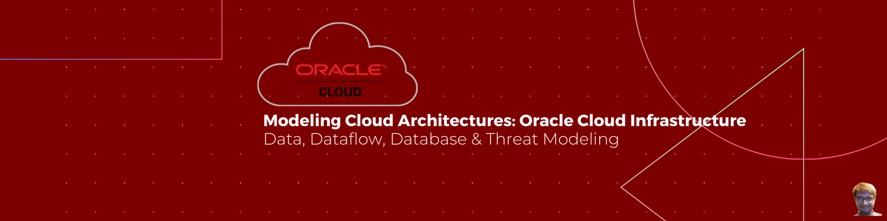

<!DOCTYPE html>
<html>
<head>

<link rel="stylesheet" href="../../resources/my_templates/Stylesheet.css">

</head>
<body>

## Project Name: {tm.name}

## OCI Reference Architecture

---

## System Description

{tm.description}

---

{tm.assumptions:if:
|Assumptions|
|:-----------:|
{tm.assumptions:repeat:|{{item}}| 
}}

## Dataflow Diagram - Level 0 DFD

## Sequence Diagram

&nbsp;

## Dataflows
Name|From|To |Data|Protocol|Port
|:----:|:----:|:---:|:----:|:--------:|:----:|
{dataflows:repeat:|{{item.name}}|{{item.source.name}}|{{item.sink.name}}|{{item.data}}|{{item.protocol}}|{{item.dstPort}}|
}

## Data Dictionary
Name|Description|Classification|Carried|Processed
|:----:|:--------:|:----:|:----:|:----:|
{data:repeat:|{{item.name}}|{{item.description}}|{{item.classification.name}}|{{item.carriedBy:repeat:{{{{item.name}}}} }}|{{item.processedBy:repeat:{{{{item.name}}}} }}|
}

## Potential Threats

|{findings:repeat:

  
   {{item.threat_id}}   --   {{item.description}}

  <h6> Targeted Element </h6>
  
 {{item.target}} 

  <h6> Severity </h6>
  
{{item.severity}}

  <h6>Example Instances</h6>
  
{{item.example}}

  <h6>Mitigations</h6>
  
{{item.mitigations}}

  <h6>References</h6>
  
{{item.references}}

  &nbsp;
  &nbsp;
  &emsp;

}|

</body>
</html>
